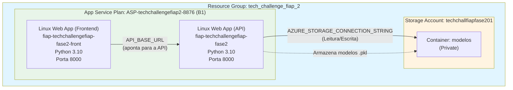
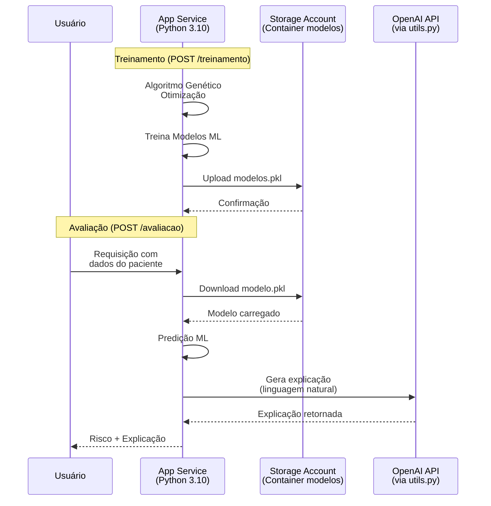

# Arquitetura de Infraestrutura - Tech Challenge Fase 2

## 1. Introdução

Este documento descreve a arquitetura de infraestrutura implementada na nuvem Azure para o projeto Tech Challenge - Fase 2. A infraestrutura foi definida utilizando **Terraform** (Infraestrutura como Código), permitindo versionamento, reprodutibilidade e gerenciamento automatizado dos recursos na nuvem.

A arquitetura foi projetada para hospedar uma aplicação Python de Machine Learning que realiza treinamento de modelos e avaliação de risco de diabetes, expondo uma **API (FastAPI)** e um **Frontend (Flask)** em **dois Azure Linux Web Apps**, conforme definido no `infra/main.tf`.

---

## 2. Visão Geral da Arquitetura

A solução utiliza uma arquitetura simplificada baseada em:

- **Azure App Service (Linux)**: Para hospedagem da aplicação web Python
- **Azure Storage Account**: Para armazenamento persistente dos modelos ML treinados
- **Resource Group**: Para organização e gerenciamento centralizado de todos os recursos

### Diagrama de Arquitetura



---

## 3. Componentes Detalhados

### 3.1. Resource Group

**Recurso Terraform**: `azurerm_resource_group.rg`

- **Nome**: `tech_challenge_fiap_2`
- **Região**: `Brazil South` (Sul do Brasil)
- **Propósito**: Container lógico que agrupa todos os recursos relacionados ao projeto, facilitando gerenciamento, monitoramento e exclusão centralizada
- **Características**: Todos os recursos filhos herdam a localização do Resource Group

### 3.2. Storage Account

**Recurso Terraform**: `azurerm_storage_account.storage`

- **Nome**: `techchallfiapfase201`
- **Tier**: `Standard` (armazenamento padrão com melhor custo-benefício)
- **Replicação**: `LRS` (Locally Redundant Storage)
  - Dados replicados 3 vezes dentro da mesma região
  - Adequado para desenvolvimento e workloads não críticos
  - Custo-benefício para o contexto acadêmico
- **Rede**: `public_network_access_enabled = true`
- **Política de retenção (Blob)**:
  - `delete_retention_policy.days = 7` (soft delete por 7 dias, conforme `blob_properties`)

### 3.3. Storage Container

**Recurso Terraform**: `azurerm_storage_container.modelos`

- **Nome**: `modelos`
- **Tipo de Acesso**: `private`
- **Propósito**: Armazenar os arquivos de modelos ML treinados (`.pkl`)
  - Modelos de Regressão Logística
  - Modelos de Random Forest
  - Modelos otimizados com Algoritmos Genéticos
  - Scalers e outros artefatos do pipeline de ML
- **Segurança**: Acesso restrito, requer autenticação

### 3.4. App Service Plan

**Recurso Terraform**: `azurerm_service_plan.app_plan`

- **Nome**: `ASP-techchallengefiap2-8876`
- **Sistema Operacional**: `Linux`
- **SKU**: `B1`
- **Propósito**: Define o ambiente de hospedagem compartilhado onde a aplicação será executada

**Observação**: limites e custos variam conforme o SKU. Este documento descreve a configuração declarada no Terraform.

### 3.5. App Service (Linux Web App - API)

**Recurso Terraform**: `azurerm_linux_web_app.app`

- **Nome**: `fiap-techchallengefiap-fase2`
- **Plataforma**: Linux com Python 3.10
- **Comando de inicialização**: `python -m uvicorn api.main:app --host 0.0.0.0 --port 8000`
- **Porta exposta**: `WEBSITES_PORT = 8000`
- **Configurações de Aplicação**:
  - `AZURE_STORAGE_CONNECTION_STRING`: Connection string do Storage Account para acesso aos modelos
    - Configurada como App Setting (variável de ambiente)
    - Permite que a aplicação leia e escreva no container de modelos
- **CORS**: `allowed_origins = ["*"]`
- **Propósito**: Hospeda a aplicação web Python que:
  - Exponde endpoints de treinamento e avaliação via FastAPI (`api/main.py`)
  - Executa treinamento e avaliação através da camada de serviços (`api/services.py`)
  - Integra com LLM (OpenAI) para explicações em linguagem natural
  - Gerencia o ciclo de vida dos modelos ML

### 3.6. App Service (Linux Web App - Frontend)

**Recurso Terraform**: `azurerm_linux_web_app.frontend`

- **Nome**: `fiap-techchallengefiap-fase2-front`
- **Plataforma**: Linux com Python 3.10
- **Comando de inicialização**: `python server.py`
- **Porta exposta**: `WEBSITES_PORT = 8000` (e `PORT = 8000`)
- **Configurações de Aplicação**:
  - `API_BASE_URL`: aponta para a URL da API (host do Web App da API)
- **CORS**: `allowed_origins = ["*"]`
- **Propósito**: hospedar a interface web (Flask) que consome a API e oferece as telas de avaliação e treinamento.

---

## 4. Fluxo de Dados

### 4.1. Durante o Treinamento

1. **Usuário/Cliente chama** o endpoint `POST /treinamento` na API (FastAPI)
2. **API executa** o pipeline de treinamento na camada de serviços (`api/services.py`)
3. **Aplica algoritmos genéticos** para otimização de hiperparâmetros (Random Forest)
4. **Treina modelos** (Regressão Logística, Random Forest base e otimizado)
5. **Serializa modelos** em arquivos `.pkl` na pasta `outputs/`
6. **Upload para Storage** via Connection String (se disponível)
   - Arquivos armazenados no container `modelos`
7. **Logs registrados** no App Service (Log Stream) e em arquivo (quando aplicável)

### 4.2. Durante a Avaliação

1. **Frontend/Cliente chama** o endpoint `POST /avaliacao` na API com os dados do paciente
2. **API carrega modelos** (priorizando download do Azure Storage quando configurado)
3. **Pré-processamento** do paciente (tratamento de zeros/NaN e normalização via scaler)
4. **Predição** do risco pelos modelos (LR e RF)
5. **Integração com LLM** (OpenAI) para gerar explicação (opcional)
6. **Retorno** das predições, probabilidades e explicação (quando gerada)

### 4.3. Diagrama de Fluxo



---

## 5. Considerações de Segurança

### 5.1. Configurações Aplicadas

1. **Storage Account**
   - Container configurado como `private`
   - Acesso apenas via Connection String (não exposta publicamente)

2. **App Service**
   - Connection String configurada como App Setting (variável de ambiente)
   - Não armazenada em código fonte
   - Gerenciada pelo Azure Portal/Terraform

3. **Boas Práticas**
   - Separar modelos do código da aplicação
   - Persistência segura de dados sensíveis (via App Settings)
   - Isolamento de recursos através do Resource Group

### 5.2. Recomendações Futuras

Para ambientes de produção, considerar:

- **Key Vault**: Para armazenamento seguro de secrets
- **Managed Identity**: Em vez de Connection Strings para autenticação
- **Network Security**: Restrições de rede (VNet, Private Endpoints)
- **Backup**: Política de backup para modelos ML críticos

---

## 6. Configurações Importantes

### 6.1. Variáveis de Ambiente

A infraestrutura configura variáveis de ambiente (App Settings) nos Web Apps. Principais:

```bash
AZURE_STORAGE_CONNECTION_STRING=<connection_string_do_storage_account>
OPENAI_API_KEY=<chave_openai>
WEBSITES_PORT=8000
```

No Frontend, a integração com a API é feita via:

```bash
API_BASE_URL=https://<hostname_da_api>
```

Estas variáveis são automaticamente injetadas no App Service e podem ser acessadas via `os.environ[...]` no código Python.

### 6.2. Dependências e Versões

- **Python**: 3.10 (configurado no `site_config.application_stack`)
- **Terraform**: `>= 1.6.0`
- **Terraform Provider**: `azurerm ~> 3.90` (conforme `required_providers`)
- **Sistema Operacional**: Linux (para App Service)

### 6.3. Localização

Todos os recursos estão configurados para a região **Brazil South**, garantindo:
- Menor latência para usuários brasileiros
- Conformidade com requisitos de residência de dados (se aplicável)
- Custo em moeda local (BRL)

---

## 7. Custos e Otimização

### 7.1. Modelo de Custo Atual

| Recurso | SKU/Tier | Custo |
|---------|----------|-------|
| App Service Plan | F1 (Free) | R$ 0,00 |
| App Service | F1 | R$ 0,00 |
| Storage Account | Standard LRS | ~R$ 0,20/GB/mês |
| **Total Estimado** | | **~R$ 0,20-1,00/mês** |

*Valores aproximados. O custo real depende do volume de dados armazenados.*

### 7.2. Otimizações Aplicadas

1. **SKU F1**: Utilização do plano gratuito (Azure for Students)
2. **LRS Storage**: Replicação local em vez de GRS/ZRS (menor custo)
3. **Standard Tier**: Em vez de Premium para Storage
4. **Resource Group único**: Facilita gerenciamento e cleanup

### 7.3. Monitoramento de Custos

- Consultar **Cost Management** no Azure Portal
- Configurar **Budget Alerts** para evitar surpresas
- Revisar periodicamente o uso de Storage (principal custo variável)

---

## 8. Deploy e Gerenciamento

### 8.1. Deploy via Terraform

```bash
# Inicializar Terraform
cd infra/
terraform init

# Validar configuração
terraform validate

# Planejar mudanças
terraform plan

# Aplicar infraestrutura
terraform apply
```

### 8.2. Destruir Infraestrutura

```bash
# Remover todos os recursos
terraform destroy
```

**Atenção**: Este comando remove permanentemente todos os recursos, incluindo modelos armazenados. Fazer backup antes de executar.

---

## 9. Monitoramento e Logs

### 9.1. Logs da Aplicação

- **App Service Log Stream**: Acesso em tempo real via Azure Portal
- **Application Insights** (opcional): Para métricas detalhadas
- **Logs locais**: Arquivo `pipeline.log` gerado pela aplicação Python

### 9.2. Métricas Principais

- **CPU Time**: Monitorar limite de 60 minutos/dia (F1)
- **Storage Usage**: Espaço utilizado no container `modelos`
- **HTTP Requests**: Volume de requisições à aplicação

---

## 10. Escalabilidade e Limitações

### 10.1. Limitações do Plano F1

- **CPU**: 60 minutos por dia
- **Memória**: Limitada (compartilhada)
- **Disco**: 1 GB
- **Aplicação pode hibernar** após inatividade

### 10.2. Opções de Escala

Para necessidades futuras de produção:

- **App Service Plan**: Atualizar para SKU superior (B1, S1, etc.)
- **Auto-scaling**: Configurar regras de escala automática
- **CDN**: Para distribuição de conteúdo estático
- **Application Gateway**: Para balanceamento de carga (se múltiplas instâncias)

---

## 11. Referências

- [Documentação Azure App Service](https://docs.microsoft.com/azure/app-service/)
- [Documentação Azure Storage](https://docs.microsoft.com/azure/storage/)
- [Terraform Azure Provider](https://registry.terraform.io/providers/hashicorp/azurerm/latest/docs)
- [Azure Pricing Calculator](https://azure.microsoft.com/pricing/calculator/)

---

## 12. Contato e Manutenção

Este documento descreve a infraestrutura como está configurada no arquivo `infra/main.tf`. Para modificações:

1. Editar `main.tf`
2. Executar `terraform plan` para revisar mudanças
3. Aplicar com `terraform apply`
4. Atualizar este documento conforme necessário

**Última atualização**: Baseado na versão atual de `infra/main.tf`

---

*Documento gerado para Tech Challenge - Fase 2 (FIAP)*