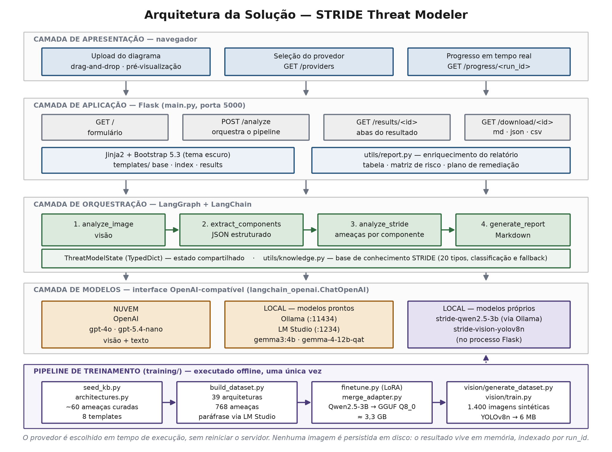
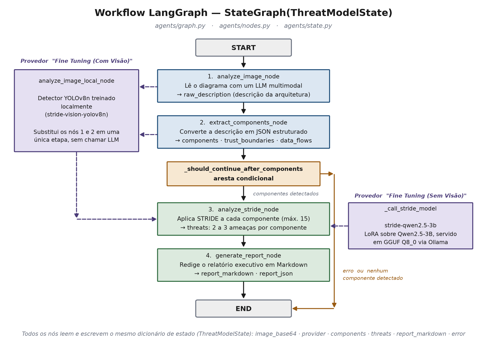

# Modelagem de Ameaças com IA — STRIDE

**Hackathon Tech Challenge Fase 5 · Pós-Tech FIAP — IA para Devs**

Solução criada para o desafio proposto no Tech Challenge - Fase 5.

A lógica do desafio: 
Envie um diagrama de arquitetura de software como imagem e receba, em minutos, um relatório
completo de modelagem de ameaças pela metodologia **STRIDE**: componentes identificados
automaticamente, ameaças por componente com severidade e referência CWE, contramedidas, matriz de
risco e plano de remediação priorizado.

A análise pode rodar na nuvem (OpenAI) ou **100% local**, com dois modelos treinados
especificamente para este projeto — nesse caso. Configuramos o projeto para rodar localmente tanto via Ollama quanto LM Studio.
Porém, os modelos fine tuning rodam apenas com *ollama* conforme descrito posteriormente neste documento.

### Integrantes do Grupo 40

- Fabio Alves De Lima 
lima.fabioalves@gmail.com 
- Fabio Crusco da Silva 
fcrusco77@gmail.com 
- Rafael Iornandes 
rafael.iornandes@gmail.com 
- Felipe Lessa de Moraes 
flmoraes70@gmail.com 

---

## Como funciona o projeto



A análise é orquestrada por um grafo **LangGraph** de quatro etapas, sobre um estado compartilhado:



| Etapa | O que faz |
|-------|-----------|
| 1. `analyze_image_node` | Lê o diagrama com um modelo de visão e produz uma descrição textual da arquitetura |
| 2. `extract_components_node` | Converte a descrição em JSON estruturado (componentes, tipos, limites de confiança, fluxos) |
| 3. `analyze_stride_node` | Aplica as seis categorias STRIDE a cada componente, gerando ameaças com severidade, contramedida e CWE |
| 4. `generate_report_node` | Converte o relatório executivo em Markdown |

Depois do grafo, o código anexa três seções calculadas deterministicamente (sem LLM): tabela
consolidada de ameaças, matriz de risco e plano de remediação priorizado.

> Se a etapa 2 não identificar nenhum componente, uma aresta condicional encerra o grafo — não faz
> sentido aplicar STRIDE sobre uma lista vazia. E se o modelo falhar na etapa 3, o pipeline usa uma
> base de conhecimento de segurança curada manualmente como resultado: **a aplicação nunca devolve
> um relatório vazio.**

---

## Instalação

Requer **Python 3.13+**.

```bash
pip install -r requirements.txt
cp .env.example .env
```

Edite o `.env` conforme o provedor que você vai usar:

```env
LLM_PROVIDER=lmstudio

# OpenAI (nuvem)
OPENAI_API_KEY=sk-sua-chave-aqui
OPENAI_MODEL=gpt-4o

# Ollama (local)
OLLAMA_BASE_URL=http://localhost:11434
OLLAMA_MODEL=gemma3:4b

# LM Studio (local)
LM_STUDIO_URL=http://localhost:1234/v1
LM_STUDIO_MODEL=google/gemma-4-12b-qat
LM_STUDIO_MAX_TOKENS=4098
```

## Executando

```bash
python main.py
```

Acesse **http://localhost:5000**.

---

## Provedores

Escolha o provedor direto na interface, sem reiniciar o servidor. A aplicação verifica em tempo
real quais estão disponíveis e marca os indisponíveis como "(offline)" — ao selecioná-los, a
própria tela mostra o que falta configurar.

| Opção na interface | Precisa de | Visão | Análise STRIDE |
|---|---|---|---|
| **OpenAI** | `OPENAI_API_KEY` no `.env` | `gpt-4o` | `gpt-4o` |
| **Ollama (local)** | `ollama serve` + modelo com visão | modelo escolhido | mesmo modelo |
| **LM Studio (local)** | Servidor local ativo no app | modelo escolhido | mesmo modelo |
| **Fine Tuning (Sem Visão)** | `ollama serve` + `stride-qwen2.5-3b` | modelo do Ollama | **modelo treinado** |
| **Fine Tuning (Com Visão)** | Acima + `pip install ultralytics` | **detector treinado** | **modelo treinado** |

Para as opções locais, deixe o processo correspondente rodando em outro terminal:

```bash
ollama serve              # Ollama e as duas opções de Fine Tuning
ollama pull gemma3:4b     # um modelo com visão, se for usar o Ollama comum
```

**Sobre o LM Studio e o campo Max Tokens:** o modelo usado nos testes (`google/gemma-4-12b-qat`) é
um modelo de raciocínio — ele consome tokens com a metodologia de "pensamento" antes de escrever a resposta. Com um limite
baixo, o JSON sai truncado e a análise retorna zero componentes, logo o resultado é vazio. Recomendamos ao menos **4096** tokens; se
ainda assim vier vazio em um diagrama grande, aumente. A aplicação também detecta o truncamento
automaticamente e repete a chamada com um orçamento maior antes de desistir.

---

## Habilitando os modelos treinados

### Modelo STRIDE (texto)

O arquivo GGUF (~3,3 GB) não cabe no repositório e precisa ser baixado uma única vez:

1. Baixe o [`stride-qwen2.5-3b-q8_0.gguf`](https://1drv.ms/u/c/00d0a6a099986c76/IQCQa17fkDcwRqPt04rnq-QzAcwb1jkWhpkIjwjtfkCwfxs?e=YO1bcI)
2. Salve em `training/output/stride-qwen2.5-3b-q8_0.gguf`
3. Com o Ollama rodando, registre o modelo:

```bash
cd training/output
ollama create stride-qwen2.5-3b -f Modelfile
```

A interface mostra o link de download e esses comandos diretamente no painel enquanto o modelo não
estiver registrado — basta selecionar a opção de Fine Tuning e seguir as instruções.

### Detector de componentes (visão)

Já vem no repositório (`training/vision/output/stride-vision-yolov8n.pt`, ~6 MB). Só precisa do
`ultralytics` instalado no mesmo ambiente da aplicação:

```bash
pip install ultralytics
```

---

## Usando a aplicação

**1. Escolha o provedor e envie o diagrama.** Arraste a imagem (PNG, JPG ou WebP) para a área de
upload ou clique para selecionar. A pré-visualização aparece com nome e tamanho do arquivo.

**2. Acompanhe a análise em tempo real.** A tela de carregamento mostra a etapa atual, o tempo de
cada uma e — linha a linha — cada componente identificado com o tipo atribuído, por meio de um sistema de logs em tempo real:

```
[1/4] Analisando o diagrama com visão computacional...
[1/4] Concluído em 18.4s — descrição gerada com 4231 caracteres
[2/4] Extraindo e classificando componentes da arquitetura...
[2/4] Concluído em 12.1s — 23 componentes, 2 limites de confiança, 19 fluxos de dados
      componente identificado: Azure API Management (tipo: api_gateway)
      componente identificado: Client mobile app (tipo: user)
      ...
[3/4] Aplicando metodologia STRIDE por componente...
[3/4] Concluído em 31.7s — 45 ameaças em 23 componentes
[4/4] Gerando o relatório executivo...
```

Isso serve de diagnóstico: se o relatório não sair satisfatório, o registro mostra em qual etapa o problema
apareceu.

**3. Leia o resultado em quatro abas.**

| Aba | Conteúdo |
|-----|----------|
| **Visão Geral** | Cartões de métrica (componentes, ameaças por severidade), diagrama analisado, distribuição STRIDE, limites de confiança e tabela de componentes |
| **Ameaças** | Acordeão por componente: contexto (tipo, limite de confiança, conexões) e um cartão por ameaça com identificador, categoria, severidade, cenário de ataque, contramedida e CWE |
| **Relatório** | Documento completo renderizado, com o diagrama embutido |
| **Exportar** | Botão de exportação em PDF e a descrição bruta da arquitetura lida pelo modelo |

---

## Resultado esperado

Para um diagrama de porte médio (arquitetura Azure API Management, 23 componentes), a análise com
`gpt-4o` produziu:

| Métrica | Valor |
|---------|-------|
| Componentes identificados | 23 |
| Ameaças geradas | 45 |
| Severidade Crítica | 14 |
| Severidade Alta | 19 |
| Severidade Média | 12 |
| Tempo total | ~1 min |

O relatório entregue tem esta estrutura:

```
# Relatório de Modelagem de Ameaças STRIDE
  > Gerado em · Ferramenta · Total de Componentes · Total de Ameaças

  1. Resumo Executivo              — síntese do risco e principais focos de atenção
  2. Visão Geral da Arquitetura    — componentes por camada e limite de confiança
  3. Análise STRIDE                — ameaças por categoria, com severidade em negrito
  4. Principais Recomendações      — controles priorizados
  5. Conclusão

  Anexo A — Tabela completa de ameaças, ordenada por severidade
  Anexo B — Matriz de risco (componentes × as seis letras STRIDE)
  Anexo C — Plano de remediação priorizado, com contramedida e CWE por item
```

Exemplo de uma ameaça no relatório:

```
[API_GATEWAY-S01] API Gateway — Spoofing — Severidade: Crítico

Atacante forja tokens JWT ou reutiliza chaves de API vazadas para acessar
endpoints protegidos sem autenticação válida.

- Vetor de ataque:  interceptação de token em cliente comprometido
- Vulnerabilidade:  validação de assinatura ausente ou incompleta
- Contramedida:     validar assinatura JWT e usar tokens de curta duração
- Referência:       CWE-347
```

A exportação em PDF (aba Exportar) usa a impressão do navegador e inclui o diagrama analisado.
Também há exportação em Markdown, JSON e CSV via `GET /download/<run_id>/<md|json|csv>`.

**Tempos observados:** com OpenAI, cerca de 1 minuto. Com LM Studio, de 2 a 5 minutos conforme o
modelo. Com os dois modelos treinados juntos ("Fine Tuning (Com Visão)"), cerca de 25 segundos —
21 componentes detectados e 18 ameaças geradas em um dos diagramas de avaliação.

---

## A metodologia STRIDE

| Letra | Ameaça | Propriedade violada |
|-------|--------|---------------------|
| **S** | Spoofing (falsificação de identidade) | Autenticidade |
| **T** | Tampering (adulteração) | Integridade |
| **R** | Repudiation (repúdio) | Não-repúdio |
| **I** | Information Disclosure (divulgação indevida) | Confidencialidade |
| **D** | Denial of Service (negação de serviço) | Disponibilidade |
| **E** | Elevation of Privilege (elevação de privilégio) | Autorização |

---

## Tecnologias

| Camada | Tecnologia |
|--------|-----------|
| Backend | Python 3.11+ · Flask |
| Orquestração de IA | LangGraph (grafo de 4 nós) · LangChain (`langchain-openai`) |
| Frontend | Jinja2 · Bootstrap 5.3 (tema escuro) · JavaScript nativo, sem build |
| Provedores de LLM | OpenAI · Ollama · LM Studio (todos via interface compatível com a da OpenAI) |
| Modelo STRIDE próprio | Qwen2.5-3B-Instruct + LoRA → GGUF Q8_0, servido pelo Ollama |
| Modelo de visão próprio | YOLOv8n treinado em dataset sintético auto-anotado (1.400 imagens) |
| Relatório | Markdown + exportação em PDF, JSON, CSV |

---

## Estrutura do projeto

```
Fase 5/
├── main.py                  App Flask — rotas e orquestração
├── requirements.txt
├── .env.example
│
├── agents/                  Pipeline LangGraph
│   ├── graph.py               Montagem do StateGraph
│   ├── nodes.py               Os 4 nós + seleção de provedor
│   ├── state.py               ThreatModelState (TypedDict)
│   └── vision_local.py        Inferência do detector YOLO treinado
│
├── templates/               Frontend (Jinja2 + Bootstrap)
│   ├── base.html              Layout, tema escuro, CSS de impressão
│   ├── index.html             Upload, seleção de provedor, progresso
│   └── results.html           Resultado em 4 abas
│
├── utils/
│   ├── knowledge.py          Base de conhecimento STRIDE (20 tipos, fallback)
│   └── report.py             Tabelas, matriz de risco, plano de remediação
│
└── training/                Treinamento dos dois modelos próprios
    ├── seed_kb.py             Ameaças STRIDE curadas manualmente
    ├── build_dataset.py       Gera o dataset de fine-tuning
    ├── finetune.py            LoRA sobre Qwen2.5-3B-Instruct
    └── vision/                Detector de componentes (YOLOv8n)
        ├── generate_dataset.py  Dataset sintético auto-anotado
        └── train.py
```

---

## Rotas

| Método | Rota | Descrição |
|--------|------|-----------|
| `GET` | `/` | Página de upload e seleção de provedor |
| `GET` | `/providers` | Disponibilidade de cada provedor, verificada em tempo real |
| `GET` | `/progress/<run_id>` | Etapas concluídas da análise em andamento |
| `POST` | `/analyze` | Executa o pipeline e redireciona para o resultado |
| `GET` | `/results/<run_id>` | Página de resultado |
| `GET` | `/download/<run_id>/<fmt>` | Exporta em `md`, `json` ou `csv` |

---

## Documentação completa

Os detalhes técnicos — arquitetura em camadas, prompts de cada nó, geração dos datasets,
hiperparâmetros de treinamento dos dois modelos, lógica de montagem do relatório e casos de uso —
estão em **`Documentacao Técnica Fase 5`**, na raiz deste diretório.

Para reproduzir os treinamentos, veja os scripts em `training/` e `training/vision/`.
